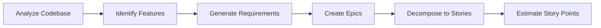
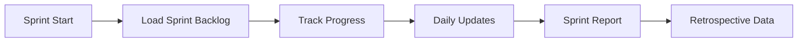

# REQ-012: Agent Backlog Commands en Workflows

## Beschrijving
Nieuwe commando's en workflows voor Claude Code agents om naadloos met het backlog systeem te werken, inclusief automatische detectie, updates, en rapportage tijdens development activiteiten.

## Rationale
Developers verliezen momentum door constant handmatig backlog items te moeten updaten. Agents kunnen dit automatiseren door:
- Context-aware operations tijdens coding
- Automatische status transitities
- Real-time synchronisatie tussen code en backlog
- Intelligente suggesties voor story decomposition

## Acceptatiecriteria

### Nieuwe Agent Workflows

#### 1. Story-Driven Development Workflow


**Trigger**: `/work-on US-014`
**Agent Actions**:
- [ ] business-analyst-justice leest story en acceptance criteria
- [ ] quality-assurance-tester genereert test skeletons
- [ ] developer-implementer cre\u00ebert implementation
- [ ] Code bevat automatisch story metadata comments
- [ ] Git commits bevatten story reference
- [ ] Story status updates automatisch

#### 2. Requirement Discovery Workflow


**Trigger**: `/discover-requirements`
**Agent Actions**:
- [ ] Code analysis voor undocumented features
- [ ] Genereer missing requirements
- [ ] Cre\u00eber epic structuur
- [ ] Splits epics in user stories
- [ ] Voeg metadata en estimates toe

#### 3. Sprint Automation Workflow


**Trigger**: `/sprint start Sprint-5`
**Agent Actions**:
- [ ] Laad alle items voor sprint
- [ ] Monitor git activity voor progress
- [ ] Update story status based op commits/PRs
- [ ] Genereer daily standup summaries
- [ ] Bereken burndown metrics
- [ ] Cre\u00eber sprint report

### Enhanced Agent Commands

#### Backlog Navigation
```bash
/backlog show           # Toon current sprint items
/backlog show --all     # Toon complete backlog
/backlog show EPIC-004  # Toon specific epic met stories
/backlog find "dashboard" # Zoek in backlog items
/backlog tree          # Toon hierarchie view
```

#### Item Management
```bash
/backlog create requirement "Need user authentication"
/backlog create story --epic EPIC-004 "As a user..."
/backlog create bug --story US-014 "Dashboard breaks on..."
/backlog update US-014 --status in_progress
/backlog assign US-014 --to @developer
/backlog estimate US-014 --points 5
/backlog link US-014 --to REQ-007
```

#### Workflow Commands
```bash
/backlog start US-014        # Start werken aan story
/backlog pause US-014        # Pauseer werk (met reden)
/backlog complete US-014     # Markeer als complete
/backlog block US-014 "Waiting for API"  # Markeer blocked
/backlog review US-014       # Start review process
```

#### Reporting Commands
```bash
/backlog report sprint       # Current sprint report
/backlog report velocity     # Team velocity trends
/backlog report epic EPIC-004 # Epic progress report
/backlog report blocked      # All blocked items
/backlog burndown           # Sprint burndown chart
```

### Agent Behavior Modifications

#### Auto-Detection Patterns
Agents detecteren automatisch:
- [ ] `// TODO:` comments → Nieuwe story/task
- [ ] `// BUG:` comments → Bug report item
- [ ] `// REQUIREMENT:` → Link naar requirement
- [ ] `@story: US-XXX` in tests → Test coverage link
- [ ] PR titel met `[US-XXX]` → Story completion

#### Smart Suggestions
Agents suggereren proactief:
- [ ] "This function is complex, split into multiple stories?"
- [ ] "No tests found for US-014, create test tasks?"
- [ ] "Story points seem high, decompose into subtasks?"
- [ ] "Multiple stories touch same code, create epic?"
- [ ] "Technical debt detected, create improvement story?"

#### Context Persistence
```yaml
# .claude-context.yml
current_work:
  story: US-014
  epic: EPIC-004
  sprint: Sprint-5
  started_at: 2025-09-08T10:00:00
  
session_stats:
  stories_completed: 2
  commits: 14
  tests_added: 23
  coverage_delta: +5%
```

### Integration Examples

#### Git Commit Integration
```bash
# Developer schrijft:
git commit -m "Add search functionality"

# Agent verbetert automatisch:
git commit -m "feat(US-014): Add search functionality to dashboard

- Implemented real-time search
- Added debouncing for performance
- Covered by tests in test_dashboard.py

Story: US-014
Requirement: REQ-007
Epic: EPIC-004"
```

#### PR Description Generation
```markdown
## Summary
Implementation of US-014: Basic HTML Dashboard

## Story Details
- **Epic**: EPIC-004 - Advanced Visualization
- **Requirement**: REQ-007 - HTML Dashboard
- **Story Points**: 8
- **Sprint**: Sprint-5

## Acceptance Criteria
✅ Dashboard displays all items
✅ Real-time search works
✅ Columns are sortable
✅ Links are clickable

## Test Coverage
- Unit tests: 85%
- E2E tests: 3 scenarios
- Performance: <1s load time

## Definition of Done
- [x] Code complete
- [x] Tests passing
- [x] Documentation updated
- [x] Code reviewed
- [ ] Deployed to staging
```

#### Daily Standup Generation
```markdown
## Daily Standup - Developer - 08-09-2025

### Yesterday
- Completed US-013 (Create backlog item)
- Started US-014 (HTML Dashboard)
- Fixed bug in validation logic

### Today
- Continue US-014 implementation
- Write tests for dashboard
- Review PR for US-012

### Blockers
- None

### Metrics
- Velocity: On track (15/20 points)
- Sprint burndown: 65% complete
```

### Success Criteria
- [ ] All agents understand backlog structure
- [ ] Commands work seamlessly during development
- [ ] Auto-updates reduce manual work by 75%
- [ ] No false positive status updates
- [ ] Reports are accurate and useful

## Implementation Notes

### Agent Training Updates
Elke agent krijgt additional instructions:
```markdown
You are backlog-aware. When working on code:
1. Always check for story context in .claude-context.yml
2. Include story IDs in commits and comments
3. Update story status when appropriate
4. Generate backlog items for discovered issues
5. Link all work to requirements/epics/stories
```

### Command Implementation
- Commands via Claude Code `/` interface
- Persistent context tussen sessions
- Rollback capability voor updates
- Dry-run mode voor testing

## Dependencies
- REQ-011: Claude Agent Integration
- REQ-009: Enhanced Metadata
- REQ-008: JSON Data Generation

## Risks
- Over-automation kan leiden tot incorrect updates
- Context loss tussen sessions
- Conflicting updates met manual changes

## Metrics
- Command usage frequency
- Time saved per developer per sprint
- Accuracy van automatic updates
- Developer satisfaction score