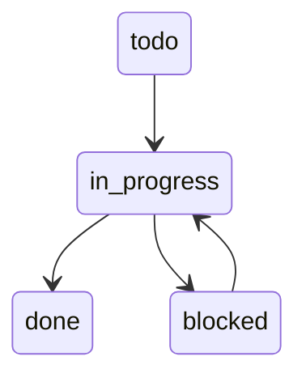

# US-003: Track Item Status Through Workflow States

## User Story
**Als** solo programmeur  
**wil ik** de status van items kunnen tracken door verschillende workflow states  
**zodat** ik altijd weet wat in progress is en wat klaar is

## Problem Statement
### Current Situation
- Geen duidelijk overzicht van werk in progress
- Items worden vergeten of dubbel opgepakt
- Geen metrics over completion rate

### Desired Outcome
- Clear status voor elk item (todo, in_progress, done, blocked)
- Visuele indicatie in dashboard
- Automatic timestamp updates

## Acceptance Criteria

### AC-1: Status State Machine
**Gegeven** een backlog item  
**Wanneer** ik de status update  
**Dan** kan alleen transitie naar valide states:
- todo → in_progress
- in_progress → done/blocked
- blocked → in_progress
- done is final state

### AC-2: Timestamp Tracking
**Gegeven** een status wijziging  
**Wanneer** de status wordt aangepast  
**Dan** wordt `updated` timestamp automatisch bijgewerkt  
**En** wordt historie bijgehouden in Git

### AC-3: Progress Visualization
**Gegeven** items in verschillende statussen  
**Wanneer** het dashboard wordt gegenereerd  
**Dan** zie ik counts per status  
**En** percentage complete voor epics/sprints

## Technical Notes

### Status Flow

### Affected Components
- YAML frontmatter: `status` field
- `/scripts/update-status.sh`
- Dashboard status counters

## Test Scenarios

### Test Case 1: Valid Transitions
1. Create item (status: todo)
2. Move to in_progress
3. Move to done
4. Verify timestamps updated

### Test Case 2: Invalid Transitions
1. Try todo → done (should fail)
2. Try done → todo (should fail)
3. Verify error messages

### Test Case 3: Bulk Status Update
1. Select multiple items
2. Update status
3. Verify all updated
4. Check dashboard reflects changes

## Definition of Done
- [ ] Status field validation
- [ ] Transition rules enforced
- [ ] Auto-timestamp updates
- [ ] Status change script
- [ ] Dashboard status widgets
- [ ] Progress percentage calculation